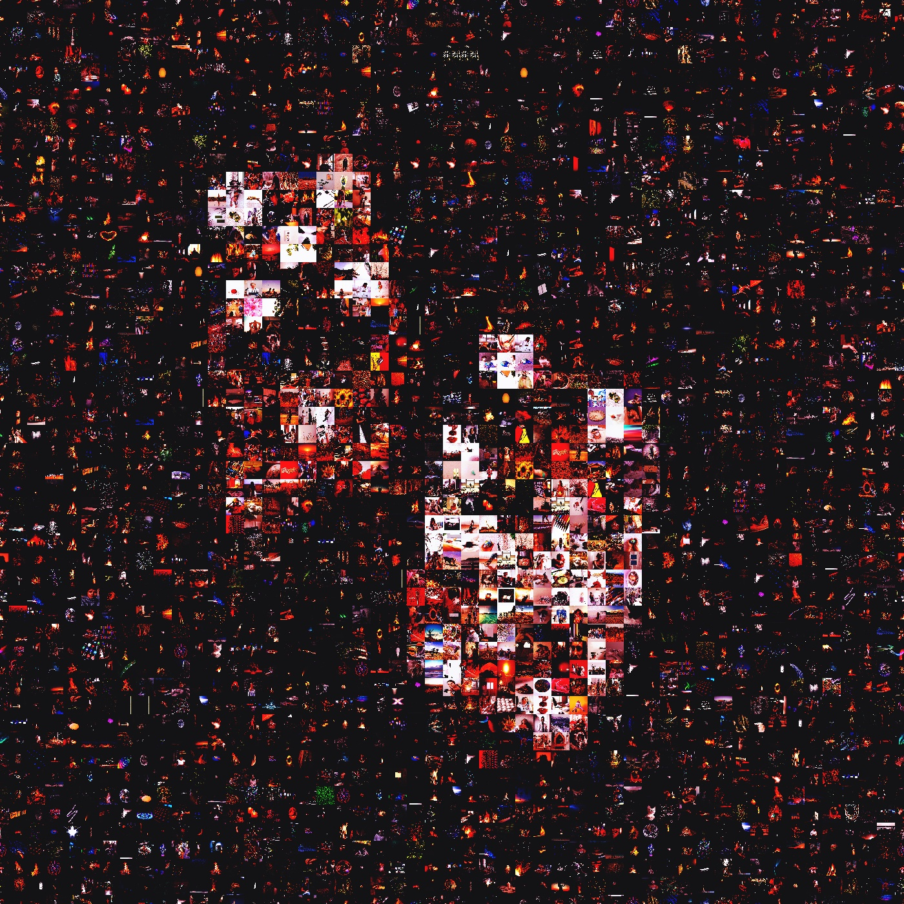

# Evolutionary(EA) Mosaic-Maker

A picture mosaic or photographic mosaic can be a beautiful expression of an image but generating one can be a computationally expensive process. Given a large database of images a brute-force method can become too costly to consider. Finding a way to reduce the number of picture mosaics considered during the generation process is critical.

This report is going to explore a method for generating a picture
mosaic using an *Evolutionary Algorithm(EA)*. Starting with a
set of random picture mosaics the algorithm is going to evolve
the set of picture mosaics to generate an output image which
resembles the given input image.

## Build Status
N/A

## Code Style
The code of this project is styled using the [PEP 8 Python Style Guide](https://peps.python.org/pep-0008/).

The program was built using Python produced with a combination of Vim, Pycharm and Visual Studio Code. The image manipulation is supported by *OpenCV* and *scikit-image*, while the image database is created using the [Pexels](https://www.pexels.com/) API.

## Core Features
The core features of this project include:
* Creation of a picture mosaic using a EA.
* Functions to create an image database using the Pexels API.
* Database image search terms.
* Experimentation rig to obtain performance measures.
* Variable and operator selection/tuning:
  * Mutation probability
  * Crossover probability
  * Stop Condition
  * Number of iterations.
  * Selection Operators
  * Number of experiment trials

To understand all the core features of the EA please read the project report titled:  *Report_Evolutionary_Algorithm_to_Evolve_Picture_Mosaics*. It can be found in the documentation directory. It details the background of the project, the workings of the EA, experiments run and performance results obtained.

## Code Example
```
def get_best_individual(self):
  """
  Returns the Individual with the best fitness value in the population.

  :return: the Individual with the best fitness value in the population
  """
  min_i = 0
  min_value = self.individual_list[0].average_fitness
  for i in range(1, self.population_size):
    if self.individual_list[i].average_fitness < min_value:
      min_value = self.individual_list[i].average_fitness
      min_i = i

  return self.individual_list[min_i]
```

## Installation and Running

### Installation
To install the project ensure your Internet connection is working and simply execute the install Bash script as follows: **sh scripts/install.sh**

The script uses the *requirements.txt* file that can be found in the documentation directory. The command can be executed using a *Linux* or *Mac* terminal, or the *Windows Subsystem* Bash terminal.

<span style="color:red; font-weight: bold;">Note</span>: I assume that you have already installed Python 3+ and [OpenCV](https://opencv.org/) on your machine.

### Download images for your Image Database
To download images for your Image database simply change the main section of the *mosaic.py* script and execute the **download_images()** function. Run this the process as many times as you would like, just ensure to watch your hard drive storage space to ensure you do not run out of space.

### Run the EA Mosaic Maker
To run the EA Mosaic Maker simply run the run Bash script as follows: **sh scripts/run.sh**

## Contribute
Contact Ibrahim Sheriff Sururu at ibrahim@uthanzi.com if you would like to contribute to this project.

## Credits
Prof. A.P. Engelbrecht who wrote *Computational Intelligence: An Introduction, Second Edition,* - John Wiley & Sons, Ltd. 2007.

Prof. W. Brink who presented *Video lecture 5.07: Camera matrices from the essential matrix,*. for the AM792 Computer Vision Class, Stellenbosch University in 2021.

Thank you to Prof. A.P. Engelbrecht for not only his resources but for the challenge.

## License
This project uses the MIT License.
